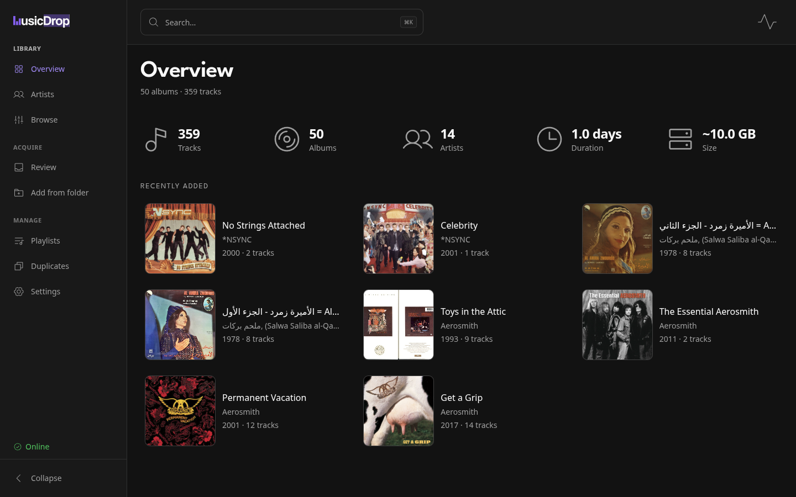
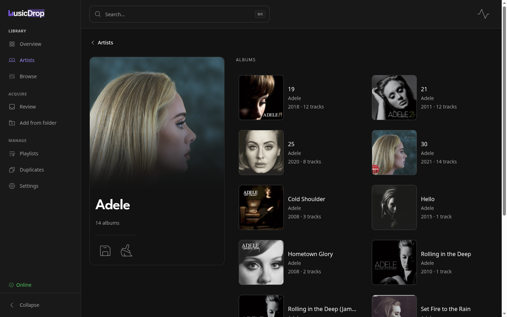
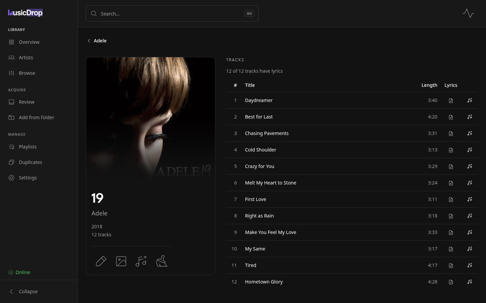

# MusicDrop

**The eye on your music library** — see what you have (and what you're missing), drive your tagging and enrichment, and build Plex-ready playlists, all without touching a terminal.

MusicDrop is a from-scratch rebuild. It keeps the name, logo, and product vision of the original (now archived for reference), but inverts the architecture: rather than maintaining its own metadata matcher, MusicDrop puts a comprehensive **web UI on top of [beets](https://beets.io)** — the mature, ~15-year-old music tagger — and adds what beets lacks: a rich visual library, playlists, and multi-user Plex sync.

## What it does

- **See your library.** Browse artists, albums, and tracks; spot the gaps (what you have vs. don't); search, and view cover art, lyrics, and track info. The library as a visual surface, not a file explorer.
- **A UI for beets.** beets' *toggles* (its config) and *actions* (`import`, `modify`, `fetchart`, `duplicates`, …) surfaced as real pages — do everything you'd do at the `beet` CLI, in the browser. The interactive import/match step gets a proper candidate-picker.
- **Playlists.** Create, edit, and delete them easily; import them from `.m3u` files or straight from Plex; **Plex-compatible**, multi-user.
- **Acquisition.** slskd downloads land in a watched inbox and flow through a unified **Review** page into the same beets import pipeline (deemix is a future adapter on the same seam).

## Architecture — the layers

beets owns the **engine and the library** (its `library.db` is the source of truth for matching, tagging, organizing). MusicDrop is the **web face and value-add** around it:

| Layer | Owner |
|---|---|
| Acquisition (slskd; deemix planned) | MusicDrop |
| Match · enrich · organize · library | **beets** |
| Decision (auto-accept policy + human review UI) | MusicDrop |
| Presentation (browse · search · art / lyrics / info) | MusicDrop |
| Playlists · Plex sync · multi-user | MusicDrop |

beets and MusicDrop are co-located on the same host: beets' library (`library.db`) and config (`config.yaml`) live on a shared path; beets' actions run in-process through a typed adapter (`app/beets/`).

## Stack

- **Backend** — Python ≥ 3.11, **FastAPI + Pydantic** on Uvicorn; **beets 2.13** (pinned `beets==2.13.*`) runs in-process behind the typed adapter in `app/beets/`. HTTP via httpx, Plex via [python-plexapi](https://github.com/pkkid/python-plexapi), YAML config editing via ruamel.yaml. Packaged with **uv**; `mypy --strict`, **Ruff** (lint + format), and **pytest** enforced in CI.
- **Frontend** — **React 19 + TypeScript**, built with **Vite**. UI is **shadcn/ui** (Radix primitives) + **Tailwind CSS 4** + [Phosphor](https://phosphoricons.com/) icons, with **League Spartan** as the display face; server state via **TanStack Query**; routing via React Router. The API client is **openapi-fetch**, and the TypeScript API types are **generated** from the backend's OpenAPI schema — never hand-written. Tested with Vitest + Testing Library + MSW.

## Status

**Actively built.** A deep beets integration and the web UI are in place.

**Shipped**

- **Browse** — artist → albums → tracklist, with cover art, lyrics, and a release's missing tracks.
- **Search** across the library.
- **Cover art** — fetch + replace.
- **Artist images** — portraits resolve automatically from the configured sources (fanart.tv → Spotify → Deezer, first verified match wins; Deezer needs no key) and are written into the library for Plex. To change one, open an artist and use the image action: pick a source, **Fetch**, and **Use this image** to keep it — or upload a file / paste a URL. **Reset to auto** forgets both your pick and the cached automatic image, so the artist is looked up again from scratch. An artist whose portrait isn't cached yet shows their initials while it resolves in the background; it appears without a reload when it lands.
- **Lyrics** — presence, per-album fetch, and a library-wide backfill. The backfill is
  **fill-gaps-only on disk**: it writes a `.lrc`/`.txt` sidecar only where none exists and
  never deletes or replaces one you already have. The one exception is a sidecar whose
  entire content is the legacy `[Instrumental]` marker: an instrumental verdict cleans it
  up, and a found verdict treats it as absent and replaces it with the fetched lyrics — a
  real sidecar, including one half of a mixed pair, is never deleted or replaced.
- **Edit tags** — album & track, from the UI. A rename that would land the album's cover on a name another file already holds is refused before anything moves — the tag changes still write, the files stay put, and the preview says why (beets alone would silently rename the cover to a `.1` sibling).
- **Import** — interactive candidate picker, resume, an import-time duplicate guard (duplicates always route to review, whatever `duplicate_action` says), and search-by-release-ID when the right match isn't offered. Unattended runs **bank** undecidable albums for later review instead of stalling, and the summary verifies each album actually **landed** in the library.
- **Duplicates** — find & resolve duplicate albums (resolve one, or resolve-all).
- **Release identity** — which release an album is (source · label · country · media · disambiguation), with view-release links.
- **Delete & Trash** — delete albums or artists into a reversible Trash; restore or empty it
  under **Settings → Trash**. If the music root is missing, empty or unreadable (an unmounted
  share), deletes are refused with a 503 — nothing is moved and no library rows are dropped —
  so a genuinely emptied library needs a remount (or beets' own CLI) before its leftover
  entries can be cleared. **Deleting an album** additionally covers the case a stray
  file used to hide: a `.stfolder`, a `lost+found` or an empty leftover directory sitting on
  a local mountpoint whose share has dropped makes the folder look mounted, so before a
  delete drops rows having moved nothing, MusicDrop confirms that at least one album it
  believes it owns is really on disk. **Restore** runs that same stronger check, above both
  of the ways it can put a folder back — it writes *into* the music library, so an unmounted
  share is the same catastrophe there, and a restore that hits one is refused with a 503
  having moved nothing out of Trash. Disk sync is the deliberate exception: it keeps the
  cheap "is the root there" test, because it runs it once per removal and accepted the same
  residual for itself. A share
  dropping part-way through an artist delete reports how many of the artist's albums were
  moved to Trash before it stopped — those are recoverable there, the rest untouched. A run
  that never moved anything says so instead of sending you to Trash: an artist whose albums
  were all rows with no files left to move reports that nothing reached the Trash folder.
- **Restore knows where things came from.** When MusicDrop moves a folder to Trash it
  records where that folder came from in a small JSON file alongside — one per Trash entry,
  under `<beets dir>/trash-origins/`, deliberately outside the trashed folder and outside
  your music library — so each row in **Settings → Trash** says what Restore will do before
  you click:
  - **Exact restore** — the folder goes straight back to its own path. This is the only way
    back for an art/booklet leftover the reorganize sweep collected, which has no audio and
    therefore cannot be re-imported at all.
  - **Approximate restore** — no usable origin, so beets re-imports the folder and files it
    under your *current* naming rules rather than putting it back. The row says which of the
    three reasons applies: it was trashed before MusicDrop recorded origins, its files came
    out of a folder shared with other music, or its origin is no longer inside the library.
    Restore stays available in all three; the row just tells you it will not be exact.
  - **Can't be restored** — the fourth way a row loses its exact move-back, and the only one
    with no restore of any kind: the Trash entry is itself a *link* to a folder on another
    volume, so following it would import files that were never in Trash. The album's own
    files were never moved — they are still where the link points, and adding that folder
    through Import is what puts it back in the library. Both of the row's own buttons are
    disabled, because both refuse it; **Empty all** is the only control that removes such an
    entry, and it removes the link alone.

  Two consequences worth knowing. A row trashed by an older version has no record and never
  will, so a media-free one (art/booklet leftovers with no audio) still has Empty as its only
  exit. (If you move or delete a Trash entry outside MusicDrop, its record is left behind as
  a harmless leftover; the next album MusicDrop trashes under that name simply gets a `(1)`
  suffix. Removing the entry through the app clears both together — except for a link entry,
  which only **Empty all** can remove, and which has no record to clear because MusicDrop
  never writes one for a link.) And a Restore whose original folder exists again *with
  anything in it* is refused rather than merged — nothing moves, the files stay in Trash, and
  the row tells you to clear that folder first; an empty leftover folder is not in the way
  and gets replaced. A Trash row listed at zero tracks only means MusicDrop couldn't read
  audio tags there; beets' importer reads more formats than the listing does, so Restore may
  still work — except on a link entry, which lists at zero tracks because nothing under the
  link is ever read, and which says outright that it can't be restored.
- **beets config** — viewer + writable editor, with advisory notices for import keys MusicDrop forces (a saved value that only affects CLI runs is flagged, not silently accepted).
- **Naming** — edit beets path/replace rules with a live preview. **Reorganize** — re-apply them to existing files, and sweep emptied leftover folders into the Trash — the sweep only ever offers folders with no audio anywhere beneath them, and never an art/booklet/scans folder sitting at a live album's own filed location. A move that would silently rename an album's cover (a stray file already holds the cover's name at the destination) is refused instead: the preview flags it as an art conflict, and apply holds back just that album.
- **Disk sync** — a `beet update` equivalent: preview-first removal of library entries whose files were deleted outside the app, plus tag refresh for files changed on disk.
- **Library dashboard** — counts, duration, size, recently added.
- **Playlists** — create / edit / delete; import from uploaded `.m3u`/`.m3u8` files or straight from Plex, with a preview that matches every entry against the library before committing (entries it can't match stay as pending rows to resolve later); merge one playlist into another; per-playlist cover artwork (upload / replace / remove — a Plex-sourced import seeds its poster automatically); `.m3u8` export, kept fresh automatically — when a library operation moves or removes files (tag edits, Reorganize, deletes, duplicate resolves, disk sync), affected playlists are re-exported, and operations that show an outcome line (tag edits, bulk duplicate resolves, Reorganize, disk sync) report how many; Plex-compatible, multi-user sync (metadata-matched, with cascade-delete). Configure Plex under **Settings → Integrations** (base URL + admin token + the music-library path *as Plex sees it*), or seed it from `MUSICDROP_PLEX_URL` / `MUSICDROP_PLEX_TOKEN` / `MUSICDROP_PLEX_LIBRARY_PATH` / `MUSICDROP_PLEX_LIBRARY_SECTION` (the Plex music-section title; leave it empty only when the server has a single music library — with several, sync refuses until one is named).
- **Acquisition (slskd)** — completed slskd downloads land in a watched inbox (webhook-driven) and queue into the import pipeline; a unified **Review** page is the one home for import decisions and inbox backlog.
- **Faceted Browse** — slice the library by genre · decade · format · type · media · country · source · lyrics coverage, sorted A–Z or recently added.
- **Live updates** — library changes stream to every open tab (SSE), no manual refresh.
- **Sign-in** — a single-password login screen, a 30-day session cookie, and a **Sign out** control in the top bar. Before a password hash is configured, the same screen is a setup notice naming the env var and the command that generates one — see [Authentication](#authentication).
- **Dark, art-forward UI** — violet-accented dark theme, dissolving detail rails, Koito-inspired row cards, a two-font type system (League Spartan display face), and the original MusicDrop logo re-colored onto the design tokens.

**Planned** — deemix acquisition adapter.

## Screenshots

| Overview | Artist | Album |
|---|---|---|
|  |  |  |

## Install (Docker)

MusicDrop ships as a single container: `ghcr.io/elienop/musicdrop` (amd64), FastAPI serving both the API and the UI on port **3030**.

```yaml
services:
  musicdrop:
    image: ghcr.io/elienop/musicdrop:latest
    container_name: musicdrop   # the `docker inspect musicdrop` commands below assume this
    ports:
      - "3030:3030"
    environment:
      - PUID=1000   # match the owner of your music share
      - PGID=1000   # (tag writes / reorganize keep that ownership)
      - TZ=Etc/UTC
      # - MUSICDROP_ARTIST_IMAGE_FANARTTV_API_KEY=…   # optional: enables fanart.tv portraits (see below)
    volumes:
      - ./data:/data            # beets library.db + config.yaml + app state
      - /path/to/music:/music   # your music library
    restart: unless-stopped
```

`docker compose up -d`, then open `http://<host>:3030`. First boot writes a starter beets config to `data/beets/config.yaml` with `directory: /music`; edit it under **Settings → Beets** (plugins, import behavior) — MusicDrop reads it like the beets CLI would, with one carve-out: in-app imports force a few `import.*` keys (`autotag`, `duplicate_action`, `singletons` — and `incremental` on sweep runs) so the review flow stays intact. The editor shows an advisory when a saved value won't take effect in-app; a CLI `beet import` still honours it. Optional integrations (slskd webhook, Plex) are configured under Settings or via `MUSICDROP_*` env vars; for slskd, mount its downloads dir (e.g. `/inbox`) and set `MUSICDROP_INBOX_DIR=/inbox`. The fanart.tv/Spotify artist-image credentials are **env-only** — Settings holds just the two on/off toggles: set `MUSICDROP_ARTIST_IMAGE_FANARTTV_API_KEY` to enable fanart.tv (`MUSICDROP_ARTIST_IMAGE_FANARTTV_CLIENT_KEY` is an optional extra passed alongside it), and both `MUSICDROP_ARTIST_IMAGE_SPOTIFY_CLIENT_ID` and `MUSICDROP_ARTIST_IMAGE_SPOTIFY_CLIENT_SECRET` for Spotify; with none set, portraits resolve from Deezer alone (which needs no key).

A few more knobs are env-only, with defaults that suit most setups:

- `MUSICDROP_INBOX_SETTLE_SECONDS` (default 60) — the quiet window an inbox folder must hold before **Review all** will import it: the inbox is slskd's live output dir, so a folder touched within the last 60 s is skipped (listed as still receiving; a per-row Review overrides) rather than imported half-finished, where the remainder would later re-import as a duplicate.
- `MUSICDROP_MAX_BODY_BYTES` (default 25 MiB) — the request-body cap: anything larger (an oversized cover upload, a giant playlist import) is refused with a 413 before the body is read.
- `MUSICDROP_LYRICS_BACKFILL_DELAY_SECONDS` (default 0.2) — the courtesy inter-track pause during lyrics fetches (the library-wide backfill and per-album fetches), also used as the inter-artist pause in the artist-image backfill; beets separately rate-limits the lyrics HTTP itself.

**Browsing by DNS name?** Requests are only accepted when the `Host` is an IP literal,
`localhost`, or a name listed in `MUSICDROP_ALLOWED_HOSTS` (comma-separated) — a
DNS-rebinding guard, same shape as Plex's and Transmission's. Reaching MusicDrop through a
reverse proxy or any hostname (`http://nas.local:3030`, `https://music.example.com`) requires
listing that name: `MUSICDROP_ALLOWED_HOSTS=music.example.com`. By-IP access always works.
Behind a proxy that rewrites `Host`, the forwarded public name (`X-Forwarded-Host`) must be in the list too — Caddy forwards both by default.
The same goes for server-to-server callers — a proxy that rewrites `Host` to an upstream
*name*, or another container calling MusicDrop by service name (slskd's webhook posting to
`http://musicdrop:3030`) — list those names too; container/host IPs always work.

### Authentication

MusicDrop has a **single account**, protected by one password. Every `/api/*` request — and
`/docs`, `/redoc`, `/openapi.json` — is refused with a `401` unless the browser holds a valid
session cookie. The only exceptions are the container healthcheck (`/api/health`), the slskd
webhook (which carries its own shared secret), and the two sign-in endpoints themselves.

**Until you set a password, nothing is reachable.** That is deliberate — there is no
"unprotected by default" mode. On a fresh install the browser lands on a **setup screen** instead
of the sign-in form: it names the env var to set (`MUSICDROP_PASSWORD_HASH`), shows the command
that generates a hash, and offers **Check again** so you can restart the container and recheck
without reloading the page. The command block comes with a **Copy** button *when the browser will
allow one* — clipboard access needs a secure page, meaning HTTPS or `localhost`, so on a plain-HTTP
LAN address the button is replaced by a line telling you to select the text instead. The command
wraps rather than scrolling, so it is fully visible either way. The startup log says the same thing
on one line:

```
security posture: prod (static_dir set); …; auth: NO password configured, so every gated API
request will be rejected until MUSICDROP_PASSWORD_HASH is set
```

Set it in two steps. First generate a hash — **never put the plaintext password in an env var**,
which is why MusicDrop has no setting for one:

```bash
docker exec -it musicdrop python -m app.auth.hash_password
# or, from a checkout:  cd backend && uv run python -m app.auth.hash_password
```

It prompts twice (hidden — nothing reaches your shell history) and prints a self-describing
scrypt string like `scrypt$131072$8$1$vIfqnSPZ…$bTMGckBk…`. Put it in your compose file and
restart:

```yaml
    environment:
      # Every $ DOUBLED: compose expands a single $ as a variable reference.
      - MUSICDROP_PASSWORD_HASH=scrypt$$131072$$8$$1$$vIfqnSPZ…$$bTMGckBk…
```

The doubling is only a `docker-compose.yml` quirk. In an `.env` file, an `env_file:`, or a plain
`docker run -e`, paste the value exactly as printed.

With a hash set, MusicDrop opens on a **sign-in screen** — one password field, no username, and
it is the only page an unauthenticated visitor can reach. Signing in sets a cookie that lasts
**30 days**, survives container restarts, and is `HttpOnly` + `SameSite=Lax`; you land on
whichever page you originally asked for rather than being dropped on the Overview. If the server
refuses, it says why in the form itself — a wrong password, a hash it cannot read, a sign-in
already in flight — rather than failing blankly.

**Sign out** is in the top bar, beside the activity indicator, at every window width; it clears
the cookie in that browser.

**Changing the password signs every session out, everywhere.** The cookie is signed with a key
derived from `MUSICDROP_PASSWORD_HASH`, so setting a new hash and restarting invalidates every
outstanding cookie — which is what you want if a password ever leaks, and worth knowing before
you rotate one casually. Deleting `data/beets/session-secret` and restarting does the same
thing without changing the password.

The one thing you cannot do is revoke a *single* session early: **Sign out** expires the cookie
in the browser, but the token itself stays valid until it expires or until you rotate one of the
two values above. There is no server-side session list, deliberately — nothing to store, sweep
or back up.

**The `Secure` flag follows the connection, so a TLS proxy pays for itself.** If you sign in over
HTTPS — directly, or through a reverse proxy that forwards `X-Forwarded-Proto` — the cookie is
marked `Secure` and your browser will refuse to send it over plain HTTP from then on.

Behind a proxy this decision rests entirely on that header, so it is worth knowing what your proxy
does with it. **Caddy** is safe by default: `reverse_proxy` sets `X-Forwarded-Proto`, and its
documentation is explicit that "for these `X-Forwarded-*` headers, by default, the proxy will
ignore their values from incoming requests, to prevent spoofing". The exception is
[`trusted_proxies`](https://caddyserver.com/docs/caddyfile/directives/reverse_proxy) — configure it
and Caddy starts *trusting* incoming `X-Forwarded-*` values from those ranges, so a range wide
enough to cover ordinary clients hands them the ability to set their own. **nginx** adds no
`X-Forwarded-*` header at all by default (its only default `proxy_set_header` directives are `Host`
and `Connection`), so a proxied deployment there needs
`proxy_set_header X-Forwarded-Proto $scheme;` — and setting it with `$scheme` rather than passing
the client's value through is what keeps it trustworthy.

The failure mode worth avoiding: a proxy that *forwards* a client-supplied `X-Forwarded-Proto`
instead of overwriting it lets a client claim `http` on a TLS connection and be handed a cookie
without `Secure`. Check your own proxy rather than assuming.

**The honest caveat is what remains over plain HTTP.** MusicDrop is designed to be browsed by LAN
IP (`http://192.168.1.10:3030`), and a `Secure` cookie is never sent over plain HTTP — marking it
there would make the app impossible to sign into in its primary deployment, so on that path the
flag is deliberately absent and the session cookie is only as private as your network. That is an
accepted residual, not an oversight. If you expose MusicDrop beyond your LAN, put it behind a
reverse proxy terminating TLS (which encrypts the hop that matters, *and* hardens the cookie as
above) and keep it off the open internet.

Releases are automatic: every merged PR that touches anything beyond markdown/docs publishes a new image tag (`vX.Y.Z`, plus `latest`) with generated notes on the [Releases page](https://github.com/Elienop/musicdrop/releases); a docs-only merge cuts no release of its own and ships with the next one.

**One-time repair, for libraries built before the path fix.** Every release up to and including v0.34.1 stored MusicDrop-imported track paths in `library.db` *absolutely* (`/music/Artist/…`) instead of relative to the music directory, the way beets does. Nothing is damaged, but such rows do not follow the music share if it ever moves to a new mount, dataset, or machine. The release containing `fix(import): store item paths relative to the music dir` stops it recurring; the existing rows need a separate one-time database repair, and **the two have to land in the same maintenance window** — deploying either half on its own leaves the importer's duplicate lookup worse off than doing neither. The procedure, starting with the census that tells you whether you are affected, is [`docs/import-path-repair.md`](docs/import-path-repair.md).

## Backup & restore

MusicDrop has no built-in backup, deliberately: its state is plain files under the paths you already mount, so a **filesystem snapshot** (ZFS/btrfs on the NAS) is the supported mechanism — nothing to export, and restoring is putting the files back.

**What to snapshot**

| Host path | Mount | Holds |
|---|---|---|
| `./data` | `/data` | `beets/` — library DB, config, bank, playlists, settings, Trash and the Trash origin records — plus `cache/artist-images/` and `cache/cover-thumbs/` |
| your music share | `/music` | the audio files, their embedded tags, `cover.<ext>`, `.lrc`/`.txt` lyric sidecars, `artist-poster.*` / `artist-background.*` |
| slskd downloads *(acquisition only)* | `/inbox` | `.musicdrop-ledger.json` — which drops were already handled; without it, old downloads re-import |

`/music` is the library; `/data` is every decision you have made about it. Snapshot both; the host paths above are `docker-compose.yml`'s placeholders.

**Authoritative** — losing it loses work, and nothing regenerates it:

- `data/beets/library.db` — the beets library: every match, tag and organize decision, plus the `lyrics_checked` and `lyrics_instrumental` flags. A `library.db-before-*.bak` sibling is a beets pre-migration copy, the only way back to the previous schema; having none is normal.
- `data/beets/config.yaml` — **Settings → Beets** and **Settings → Naming** both write this file in place and keep no previous copy.
- `data/beets/bank/*.json` — albums banked for review. Pending decisions, not a cache.
- `data/beets/playlists/*.json` and `data/beets/playlists/artwork/` — MusicDrop owns playlists; Plex is a push target, not a copy.
- `<music>/.playlists/*.m3u8` — the Plex-readable exports. Rewritten only when a playlist changes, never rebuilt wholesale, so the music tree's restore is what covers them; `MUSICDROP_PLAYLISTS_EXPORT_DIR` takes them out of it — snapshot that path too.
- `data/beets/plex/plex.json`, `data/beets/slskd/slskd.json` — the Plex and slskd integration settings, mode `0600`. Not just tokens: Plex's library path/section, slskd's downloads prefix and its `auto_import` toggle (lose that and unattended import reverts to its env default, off).
- `<inbox>/.musicdrop-ledger.json` — the handled-drops record. Defaults to `<beets_dir>/inbox`, inside `/data`; `MUSICDROP_INBOX_DIR` moves it onto the slskd downloads mount — the table's third row.
- `data/beets/trash/` — deleted albums live here and nowhere else until you empty the Trash; normally the only GB-scale item under `data/`.
- `data/beets/trash-origins/*.json` — where each trashed folder came from, one tiny file per Trash entry. Nothing else records it: restore the Trash without these and every row falls back to the approximate restore, which for an art/booklet leftover with no audio means no way back at all. `MUSICDROP_TRASH_ORIGINS_DIR` moves them.
- `data/beets/state.pickle` — beets' import state. The banking sweep's forced `incremental` reads its `taghistory`; without it the next sweep re-offers every folder it has already handled.
- `data/cache/artist-images/` — the `*.override` (+ `*.override.mime`) images you uploaded or pasted by hand, which nothing refetches, and `_enabled.json` / `_art_write_enabled.json`, the two artist-image toggles: lose those and both revert to their env defaults (`MUSICDROP_ARTIST_IMAGES_ENABLED` / `MUSICDROP_ARTIST_ART_WRITE_ENABLED`, off unless set).

Those are the shipped image's paths (`MUSICDROP_BEETS_DIR=/data/beets`, `MUSICDROP_ARTIST_IMAGE_CACHE_DIR=/data/cache/artist-images`). Override either and the tree under it moves; a `MUSICDROP_*_DIR` for trash, trash origins, bank, playlists, Plex, slskd or the inbox moves that subtree out from under `<beets_dir>`; and `config.yaml`'s `library:` and `directory:` relocate the DB and the music tree with no env var at all. Snapshot what these resolve to, not the defaults.

**Regenerable** — don't worry about these:

- `data/cache/artist-images/*.bin` · `*.mime` · `*.miss` — the auto-fetch cache and its negative markers, refetched on demand.
- `data/cache/artist-images/*.thumb.bin` · `*.thumb.src` — the 320px WebP portraits the grids and rosters render, re-derived from the `*.override` or `*.bin` beside them the moment the sidecar's source tag stops matching.
- `data/cache/cover-thumbs/` — the same derivation for album covers (`MUSICDROP_COVER_THUMB_CACHE_DIR=/data/cache/cover-thumbs` in the shipped image). Nothing authoritative is here at all: unlike the artist cache this one never owns an original — every cover it thumbnails lives in the music tree, as an art file or an embedded tag. Delete the whole directory and the next page view rebuilds what it needs.
- `data/beets/session-secret` — the key your session cookie is signed with, mode `0600`. Restoring it keeps you signed in across the restore; losing it just means signing in again on the next visit, which is also how you revoke every outstanding session on purpose. It is *not* your password — that lives only in `MUSICDROP_PASSWORD_HASH`, so a snapshot with no `session-secret` still lets you in.
- import, backfill and sweep jobs — in memory only; they don't survive a restart anyway.

**Snapshot consistency**

You need not stop MusicDrop to take a snapshot. `library.db` is SQLite in its default rollback-journal mode (`journal_mode=delete`; neither beets nor MusicDrop switches it to WAL), so a `library.db-journal` sidecar exists only while a write transaction is open, and a snapshot atomic within the dataset captures the DB and that journal together — what SQLite needs to roll the interrupted transaction back. A snapshot of a running MusicDrop is crash-consistent; at worst one in-flight write is discarded.

Separate datasets don't change that, so long as ONE snapshot operation covers both, and [`zfs-snapshot(8)`](https://openzfs.github.io/openzfs-docs/man/master/8/zfs-snapshot.8.html) promises a shared instant for exactly one form — `-r`: "[r]ecursive snapshots created through the `-r` option are all created at the same time". Take it over a common ancestor; within a pool one always exists (`zfs list` shows your layout), and on TrueNAS it is one Periodic Snapshot Task with **Recursive** ticked. Two *separate* operations — different pools, or a task each — are two instants, and moves fall through the gap: deleting to Trash moves a whole album folder from `/music` into `data/beets/trash/` under `/data`, and inbox drops import with `operation="move"`. Caught between the instants, that album is in both snapshots, in neither, or split across them — and `shutil.move` across filesystems is copy-then-delete, so a file can be captured truncated. The result is a folder to re-import or re-delete, not a damaged library; on that layout, snapshot with the container stopped, or at least never during a delete, a Trash restore, or an inbox import.

Quiescence comes from the process being gone, not from the shutdown grace: MusicDrop waits ~5s for an in-flight import to release the slot, but the beets worker is a daemon thread it cannot join, so past that bound the library closes under a still-running import. For the snapshot you keep as the restore point of record, snapshot after `docker compose down` returns.

**Record the image tag in the snapshot's name.** Nothing inside the snapshot records it, and by restore time the container that could tell you is gone — so read it now, from the sidebar's health row, `GET /api/version` (signed in — it is behind the session gate, unlike the bare `/api/health` liveness probe), or `docker inspect musicdrop --format '{{range .Config.Env}}{{println .}}{{end}}' | grep MUSICDROP_VERSION`.

**Never run without the `./data` bind mount**

The image's `VOLUME /data` makes a *missing* bind mount silent rather than fatal: Docker creates an anonymous volume under `/var/lib/docker/volumes/` and your library lives on a path no snapshot policy is aimed at. To confirm where it resolves:

```bash
docker inspect musicdrop --format '{{range .Mounts}}{{.Source}} -> {{.Destination}}{{"\n"}}{{end}}'
```

If that prints `/var/lib/docker/volumes/<hash>/_data -> /data`, your library is in an anonymous volume. Move it out: `docker compose down`, `mkdir -p ./data && sudo cp -a /var/lib/docker/volumes/<hash>/_data/. ./data/`, add `- ./data:/data` to the compose file, `docker compose up -d`, then re-run the inspect and confirm the app still shows your library. Leave the old volume alone — an orphaned volume costs disk, and it is your only second copy until the next snapshot runs.

**Restoring**

Restore through your NAS's snapshot tooling; a few principles are all this needs. Stop MusicDrop first — it holds the library DB open while it runs. Put back **only** the tree you actually lost: a snapshot laid over a tree you still have reverts everything changed in it since — on the music share every tag write and every cover, portrait and lyric file, and under `./data` every import, edit and decision. Restore files rather than `zfs rollback`, which discards all data changed since the snapshot across the whole dataset ([`zfs-rollback(8)`](https://openzfs.github.io/openzfs-docs/man/master/8/zfs-rollback.8.html)). Pin the image to the tag in the snapshot's name: beets migrates `library.db` on open, one-way, and an old snapshot booted once under a newer image cannot go back without the `library.db-before-*.bak` beets writes before migrating. Start the app only once everything is back in place.

**Restoring the music share onto a different path** — a renamed dataset, a new bind mount, a new box — needs [`docs/import-path-repair.md`](docs/import-path-repair.md) done first, on libraries that predate the path fix. Rows holding absolute paths do not follow the move, and the next `beet update` or disk sync removes them from the library: the audio files stay on disk, but their added dates, play counts, lyrics, flexible fields and album grouping do not. The repair is one migration and takes one maintenance window.

**Test the restore once**

An untested restore is a hypothesis. Do the drill once, while nothing is broken: restore a snapshot into a scratch directory and point a throwaway compose file at it — a different port, a different `container_name` (`docker-compose.yml` pins `musicdrop`, so a copy changing only ports and volumes clashes on the name), and the music share **read-only** (`- /path/to/music:/music:ro`) so the drill cannot touch it. If **Library → Overview** shows your library, the backup works. Never point a second container at the live `/data`: MusicDrop must be the only process holding the library open.

## Development

MusicDrop is two apps: a FastAPI backend (`backend/`) and a Vite + React frontend (`frontend/`). Run both in dev — the frontend proxies `/api` to the backend, so there's no CORS or base-URL juggling. Layout: `backend/app/` is the API (`api/` routers · `models/` the Pydantic contract · `beets/` the beets-adapter boundary) with tests in `backend/tests/`; `frontend/` is the React + shadcn UI.

**Prerequisites:** Python ≥ 3.11 with [uv](https://docs.astral.sh/uv/); Node 22+ with npm.

**Backend** (from `backend/`):

```bash
uv sync --extra dev                                # install (incl. dev tools)
uv run uvicorn app.main:app --port 3030 --reload   # API on http://localhost:3030
uv run pytest                                      # tests
uv run mypy                                         # strict typecheck (must be clean)
uv run ruff check                                  # lint
uv run ruff format                                 # format
```

**Frontend** (from `frontend/`):

```bash
npm install        # install
npm run dev        # Vite dev server on http://localhost:5173 (proxies /api -> :3030)
npm run test       # vitest
npm run lint       # eslint
npm run typecheck  # tsc
npm run build      # production build
```

`npm run lint` is deliberately narrow: it enables one rule per SonarQube family this
project has already driven to zero, so it guards against regrowth rather than imposing a
new style. Adding a rule for anything else is a design change — see the header of
`frontend/eslint.config.js`, and `frontend/eslint.config.test.ts`, which proves every
enabled rule still fires.

Keep the backend on port **3030** — that's the target of the Vite dev proxy.

**API types are generated, not hand-written.** The frontend's TypeScript API types come from the backend's OpenAPI schema — never edit `src/api/schema.d.ts` by hand. After changing a Pydantic model, run both steps from the repo root (a CI guard fails if `frontend/openapi.json` drifts from the live spec):

```bash
cd backend && uv run python scripts/dump_openapi.py   # app -> frontend/openapi.json
cd ../frontend && npm run gen:api                     # frontend/openapi.json -> src/api/schema.d.ts
```

**Coverage** (from the repo root):

```bash
make coverage     # both suites with coverage on -> backend/coverage/, frontend/coverage/
```

It writes four gitignored reports for SonarQube: Cobertura XML and JUnit XML for the backend, `lcov.info` and Sonar's generic test-execution XML for the frontend. Coverage is opt-in and off every default path — plain `uv run pytest` and `npm run test` behave exactly as they always have and write nothing; run `npm run test:coverage` for the frontend on its own. (`sonar-scan`, which runs `make coverage` before each upload, is a local wrapper of the maintainer's and is not part of this repo.)

## Decisions

- **Backend: Python-native** (FastAPI + Pydantic, beets driven in-process behind a typed adapter in `app/beets/`). Locked — one runtime, since deemix is Python and slskd is just an HTTP API.
- **The API is the contract.** Every endpoint takes/returns Pydantic models; the OpenAPI schema is the source of truth, and the frontend TypeScript types are generated from it (never hand-written).
- **beets owns the engine + library.** All beets access lives behind the typed adapter in `app/beets/`, where beets' global config/plugin singletons stay isolated.
- **Browse is a single artist spine** (roster → artist → albums → tracks), not a flat album grid.
